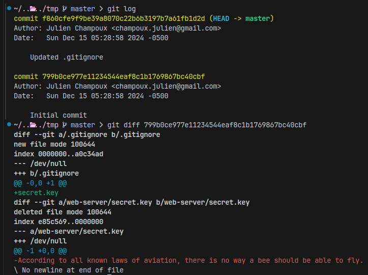

# ☃️ Snowman Urgent Care Center ☃️
## Writeup
### First look
When opening the challenge, we're presented with a fantastic homepage.

On there, we can find a form where we can submit some personal details. After submission, we get told that our case has been sent to triage.

### A not so secret key
After downloading the source code and untar'ing it, one of the first things that we can notice is the `app.secret` key being set in the Flask application. This is typically not done manually, so it's usually a sign that some funny business is going down.

In the case of this challenge, it's reading the secret key from a file called `secret.key`, which seems to be nowhere to be found.

However, with a bit of observation (or the right file explorer defaults), we can see that the `.tar.gz` that we obtained is actually a Git repository. By checking `git log`, we can see a commit that updates the `.gitignore` and by digging a little deeper, we find our secret.



`According to all known laws of aviation, there is no way a bee should be able to fly.`

### The backend
Having the Flask secret is useful, it lets us control our session arbitrarily, but that's not very handy if we don't know what to do with it. This is where we start looking at the actual logic behind the application.

After submitting our personal details, they get processed by the `POST /submit` endpoint. Here is the source code of the handler:

```python
class SubmitModel(BaseModel):
    name: str = Field(min_length=1, max_length=32)
    temperature: int = Field(ge=-30, le=30)
    symptoms: str = Field(min_length=1, max_length=512)

@app.post("/submit")
@validate()
def submit(form: SubmitModel):
    app.logger.info(f"Received case: {form}")

    safe_path = (
        CASES_DIR.joinpath(f"{session['sid']}.json").resolve().relative_to(CASES_DIR)
    )
    safe_path = CASES_DIR.joinpath(safe_path)

    case_json = form.model_dump_json()
    open(safe_path, "w").write(case_json)

    upload_cases_to_triage()
    create_session()

    return render_template("triaging.html")
```

First, our input is parsed as a `SubmitModel` object and validated with the Pydantic `@validate()` decorator. This means that whatever form data we send to the server will have to respect the `SubmitModel` specification.

Afterwards, a path is constructed with a static directory joined to our session ID (a UUID generated by the application). We can note that this is taken from our user session and is therefore fully controllable since we have the Flask secret key. Let's keep that in mind for later.

> Path traversals are avoided with the `.resolve` and `.relative_to` calls. See the [documentation](https://docs.python.org/3/library/pathlib.html#pathlib.PurePath.relative_to) for more information.

Following this, our user details are dumped as a JSON object and stored at the path constructed above.

There is then a call made to `upload_cases_to_triage` and finally, a call to `create_session`, which picks a new session ID.

The code of `upload_cases_to_triage` goes as follows:

```python
def upload_cases_to_triage():
    client = FtpClient("triage-server", 21)
    client.connect()
    client.login(os.getenv("TRIAGEUSER"), os.getenv("TRIAGEPASS"))

    for file in os.listdir(CASES_DIR):
        case_file = CASES_DIR.joinpath(file)

        try:
            with Timeout(3):
                client.upload_file(case_file, Path(file))
                time.sleep(1)  # don't overload ftp server
        except:
            pass

        os.remove(case_file)
```

An `FtpClient` is created, which connects to the triage server. The credentials are provided in the `docker-compose.yaml` and are available with the challenge files, but they're not very useful.

All of the files in the previously mentioned static directory are then uploaded through our FTP client and subsequently removed from the filesystem.

Assuming that this is a proper FTP library with good sanitization, there doesn't seem to be an issue here. Unfortunately, this isn't a proper FTP library with good sanitization, it's a homemade micro-library.

### FTP shenanigans
With our challenge files, we can find the `ftp.py` file which contains a small homemade library for FTP connectivity. Only a few functions are available such as `PWD`, `LIST` and `STOR` ("print working directory", "list files" and "store file" respectively).

Keeping in mind that we can control the filename, we can look at the code and see if we can impact anything with it.

This is the `upload_file` code:

```python
def upload_file(self, local_path: Path, remote_path: Path):
    self._check_logged_in()

    with open(local_path, "rb") as f, self._data_stream() as ds:
        self._send_cmd("STOR", str(remote_path))
        code, text = self._recv_reply()
        if code // 100 != 1:
            raise FtpException(f"error: {code} {text}")

        data = f.read()
        while len(data) > 0:
            written = ds.write(data)
            data = data[written:]

    code, text = self._recv_reply()
    if code // 100 != 2:
        raise FtpException(f"error: {code} {text}")
```

Our `local_path` is simply read from, nothing to be done here without a path traversal. However, the `remote_path` is also derived from our controlled path and it's being sent through `_send_cmd`. Let's take a look at that code.

```python
def _send_cmd(self, command: str, arg: str | None = None):
    line = command
    if arg:
        line += f" {arg}"
    line += "\r\n"
    self._sock.write(line.encode())
```

Here we see that the `_send_cmd` function simply takes our command and concatenates it with our argument, separated by a space and terminated with a CRLF. It might be easy to take a guess at the issue here, but why not read [the RFC](https://datatracker.ietf.org/doc/html/rfc765)?

Page 31:

```
FTP commands are "TELNET strings" terminated by the "TELNET end of
line code".  The command codes themselves are alphabetic
characters terminated by the character <SP> (Space) if parameters
follow and TELNET-EOL otherwise. ...
```

This corresponds to what we see in the code. `TELNET-EOL`'s are `CRLF`'s and our command is followed by a space after which our argument is appended.

> This is a good time to mention that UNIX file paths can contain a plethora of lovely characters, _including_ newlines and carriage returns. (Feel free to experiment with this.)

Since we can input `TELNET-EOL`'s into our session which will end up in our filenames, we can use this to inject FTP commands in the communication.

Something like: `hello_world \r\n my_injected_command \r\n noop`

### More FTP shenanigans
We now have a way to send arbitrary FTP commands to the triage server. However, we have no useful feedback, no output and unfortunately, no flags. Fortunately for us, this is about to change with a little FTP knowledge.

FTP is commonly thought of as a simple client to server file transfer protocol, but anyone who has had to deal with port-forwarding has inevitably come across the so-called `passive` and `active` modes.

To understand these, we need a basic understanding of the FTP model (I have shamelessly stolen this diagram from the RFC mentioned above, this will only provide a cursory glance so feel free to read it).

```
                                            -------------
                                            |/---------\|
                                            ||   User  ||    --------
                                            ||Interface|<--->| User |
                                            |\----:----/|    --------
                  ----------                |     V     |
                  |/------\|  FTP Commands  |/---------\|
                  ||Server|<---------------->|   User  ||
                  ||  PI  ||   FTP Replies  ||    PI   ||
                  |\--:---/|                |\----:----/|
                  |   V    |                |     V     |
      --------    |/------\|      Data      |/---------\|    --------
      | File |<--->|Server|<---------------->|  User   |<--->| File |
      |System|    || DTP  ||   Connection   ||   DTP   ||    |System|
      --------    |\------/|                |\---------/|    --------
                  ----------                -------------

                  Server-FTP                   User-FTP
```

TL;DR FTP is a protocol that works with two separate connections, one control connection (based on TELNET) that handles commands and one data connection where the data is transferred.

The _active_ and _passive_ modes refer to the establishment method of this data connection. Indeed, while the control connection is required to exist at all times during the exchange, the data connection is opened and closed ad-hoc.

In passive mode, the user asks the server for its passive listening port via `PASV` and then connects to it, establishing the data connection which can be used for transfers.

In active mode, the user uses the `PORT` command to provide an IP (typically the client's public IP) and a PORT where the user will listen for a data connection. Upon starting a transfer, the server will then connect to said IP:PORT combination and the data transfer can begin.

The active mode may seem like an unnecessary hassle, but it has its uses. For example, if the server can only listen on one static port for its control connection, the active mode would let the server setup the data connection without opening extra ports. Assuming that the client is publically reachable, this can help surpass the shortcomings of NAT'ing.

The active mode is _also_ useful for site-to-site transfers. This is explained quite well at page 41 of the RFC, but in short, a client can setup two connections to two different FTP servers setting up a passive data connection on one side and an active connection to the first server on the other side. A `STOR` can then be emitted on the first side and a `RETR` on the other, which will perform a data transfer from the first site to the other. **This is what we'll be doing to extract our flag.**

> Note that the default settings of `vsftpd` (used in this challenge) do not allow this kind of site-to-site transfer. `promiscuous_enable` needs to be enabled to allow `PORT` to specify an IP other than the client's.

### Flagging
We now have all of the pieces to our puzzle. I won't create a walk through for this part since it's a good exercise to implement it (and also because I'm lazy). You may refer to the [solving script](/solver.py) for a pre-built solution.

`h0h0h0{ftp_is_f4nt4st1c_0f827e4c}`